# Dokumentasi UAS – Administrasi Server (Cloud Computing II)

**Dosen Pengampu:** Mohamad Firdaus, M.Kom.

---

## Daftar Isi
1. [Langkah 1 – Persiapan Lingkungan](#langkah-1)
2. [Langkah 2 – Membuat Repository GitHub](#langkah-2)
3. [Langkah 3 – Menyiapkan Docker & Docker‑Compose](#langkah-3)
4. [Langkah 4 – Membuat CI/CD Pipeline (GitHub Actions)](#langkah-4)
5. [Langkah 5 – Deploy Aplikasi Statis (Web CV)](#langkah-5)
6. [Langkah 6 – Deploy Aplikasi Dinamis (Node/PHP/Python)](#langkah-6)
7. [Langkah 7 – Pengaturan Database MariaDB](#langkah-7)
8. [Langkah 8 – Pengujian Live Test & Auto‑Update](#langkah-8)
9. [Langkah 9 – Dokumentasi Teknis (README.md)](#langkah-9)
10. [Langkah 10 – Pengambilan Screenshot & Bukti](#langkah-10)
11. [Langkah 11 – Penilaian Akhir & Submit](#langkah-11)

---

### Langkah 1 – Persiapan Lingkungan
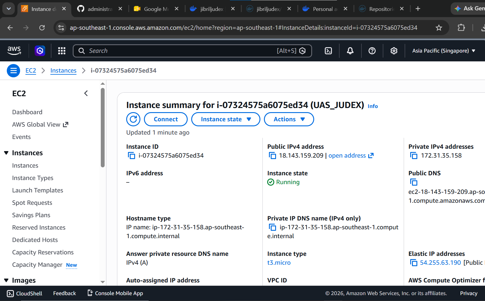
*Gambar menunjukkan persiapan server AWS EC2, instalasi Docker, Docker‑Compose, dan konfigurasi security group.*

### Langkah 2 – Membuat Repository GitHub
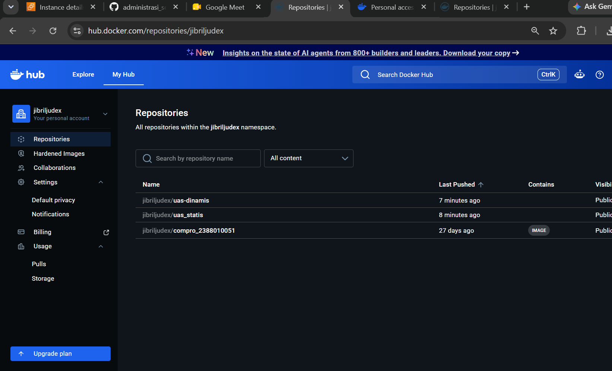
*Repositori dibuat dengan struktur folder `web-statis` dan `web-dinamis`, serta file `.github/workflows` untuk CI/CD.*

### Langkah 3 – Menyiapkan Docker & Docker‑Compose
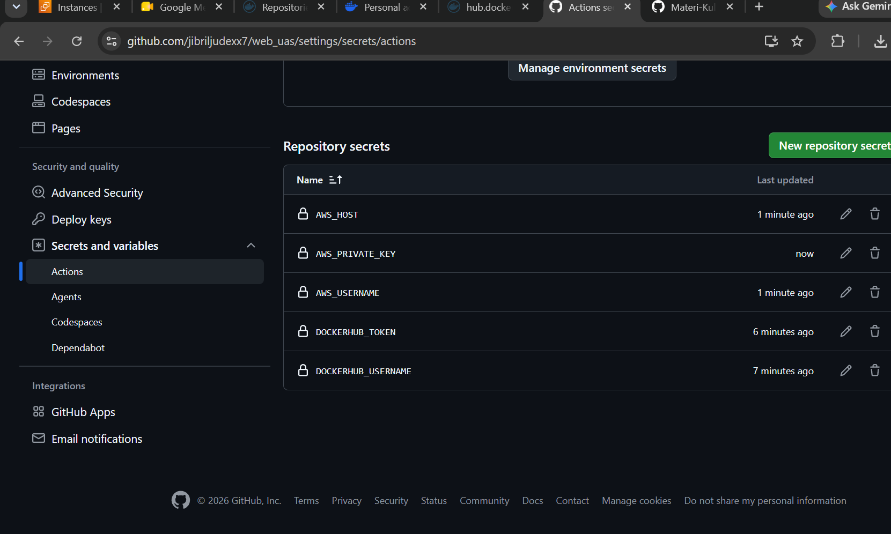
*File `docker-compose.yml` berisi service untuk web‑statis, web‑dinamis, dan MariaDB dengan network internal.*

### Langkah 4 – Membuat CI/CD Pipeline (GitHub Actions)
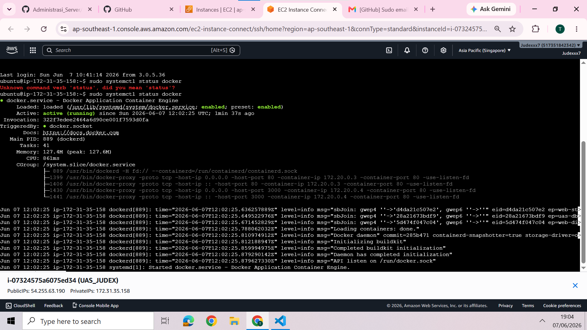
*Workflow GitHub Actions (`deploy-statis.yml` & `deploy-dinamis.yml`) melakukan build image, push ke Docker Hub, dan deployment ke EC2 via SSH.*

### Langkah 5 – Deploy Aplikasi Statis (Web CV)
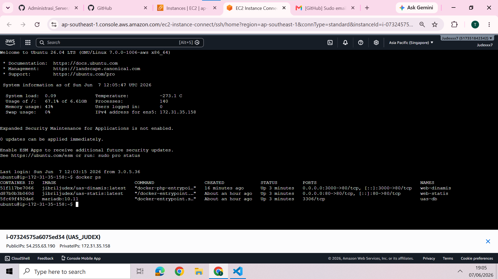
*Setelah pipeline selesai, aplikasi web‑statis dapat diakses pada port 80 melalui public IP AWS.*

### Langkah 6 – Deploy Aplikasi Dinamis (Node/PHP/Python)
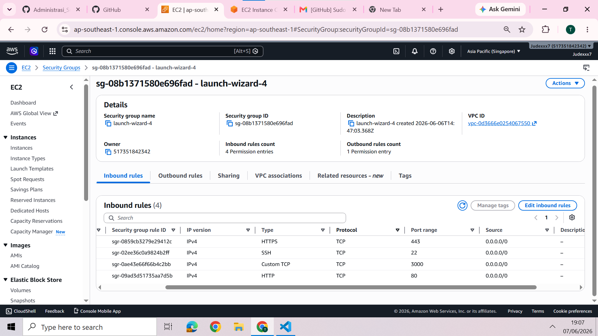
*Contoh deploy aplikasi dinamis menggunakan PHP (atau Node.js/Python) dengan environment variable yang diperlukan.*

### Langkah 7 – Pengaturan Database MariaDB
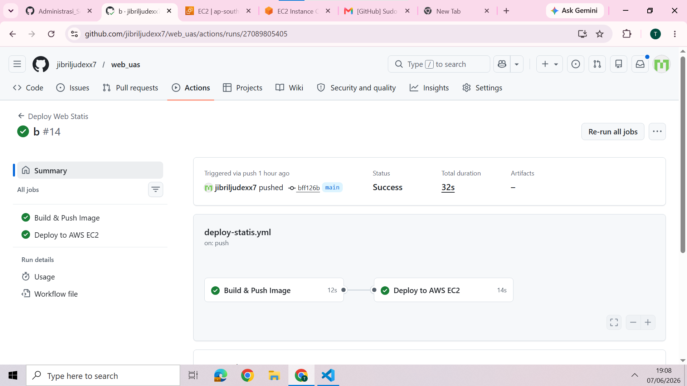
*Database MariaDB di‑seed otomatis menggunakan skrip SQL pada folder `/docker-entrypoint-initdb.d/`.*

### Langkah 8 – Pengujian Live Test & Auto‑Update
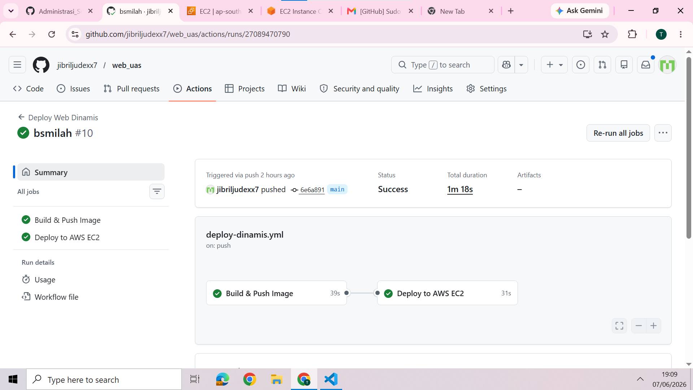
*Demo perubahan kode lokal, commit, push, dan pipeline men‑update container secara otomatis tanpa downtime.*

### Langkah 9 – Dokumentasi Teknis (README.md)
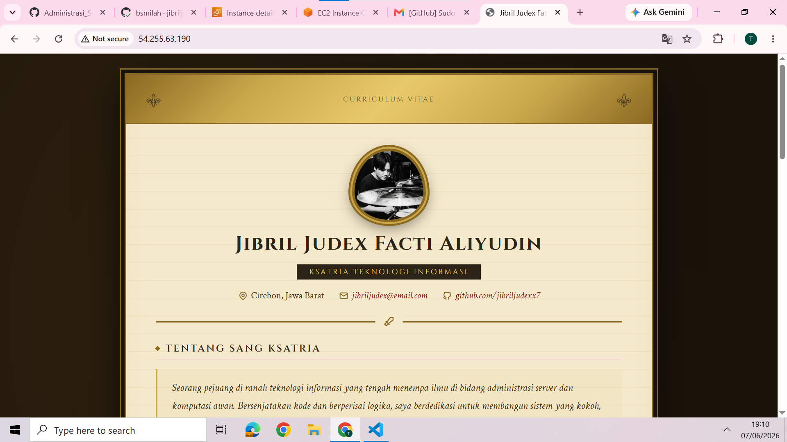
*README berisi arsitektur, cara menjalankan, variabel lingkungan, dan link ke repository.*

### Langkah 10 – Pengambilan Screenshot & Bukti
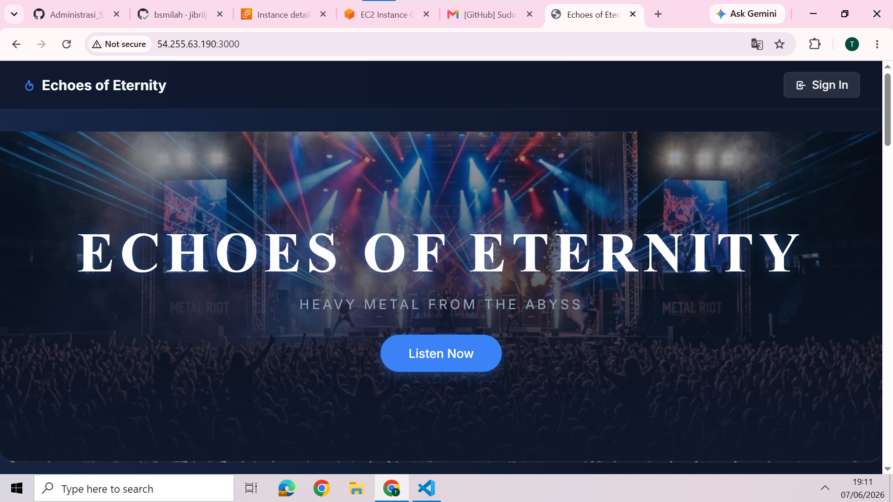
*Screenshot hasil pipeline hijau, port mapping, serta tampilan aplikasi di browser.*

### Langkah 11 – Penilaian Akhir & Submit
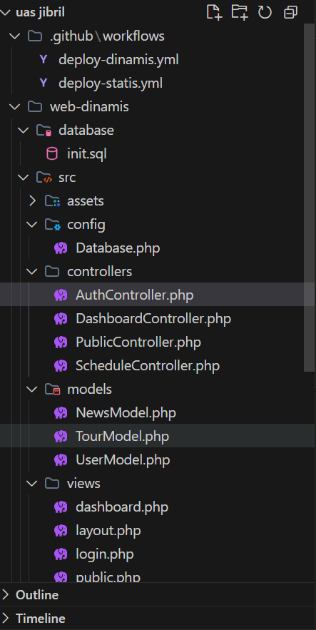
*Mahasiswa menyiapkan laporan akhir, mengunggah ke portal UAS, dan menunggu penilaian akhir.*
